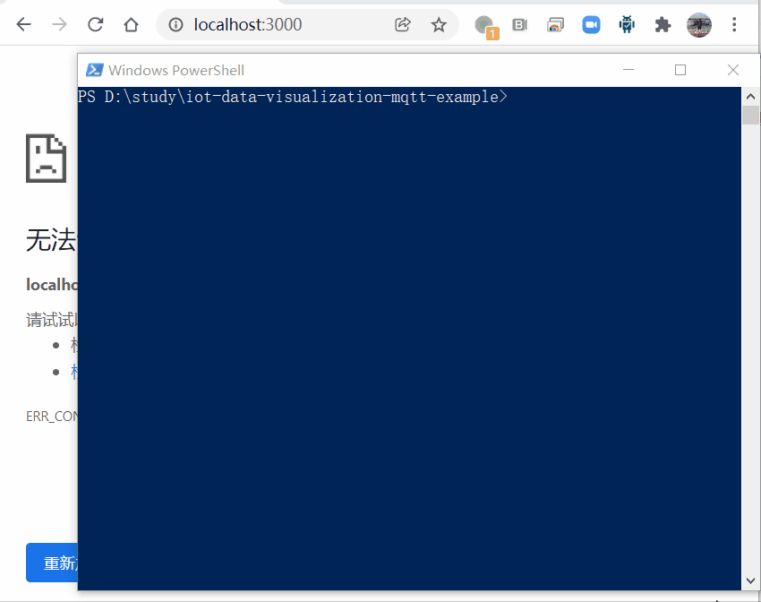

# iot-data-visualization-mqtt-example

iot data visualization mqtt example | 基于 mqtt 的 iot 数据展示示例 

- `./web` for data visiualization | 用于展示 iot 设备的图形化展示（DV）
- `./iots` mimic iot devices | 模拟 iot 设备

## try it out | 运行



```
docker-compose up
```

open | 打开 http://localhost:3000

## why mqtt

easy scaling
https://www.hivemq.com/solutions/technology/kubernetes/

cross language/platform
https://www.hivemq.com/mqtt-client-library-encyclopedia/

## system design

